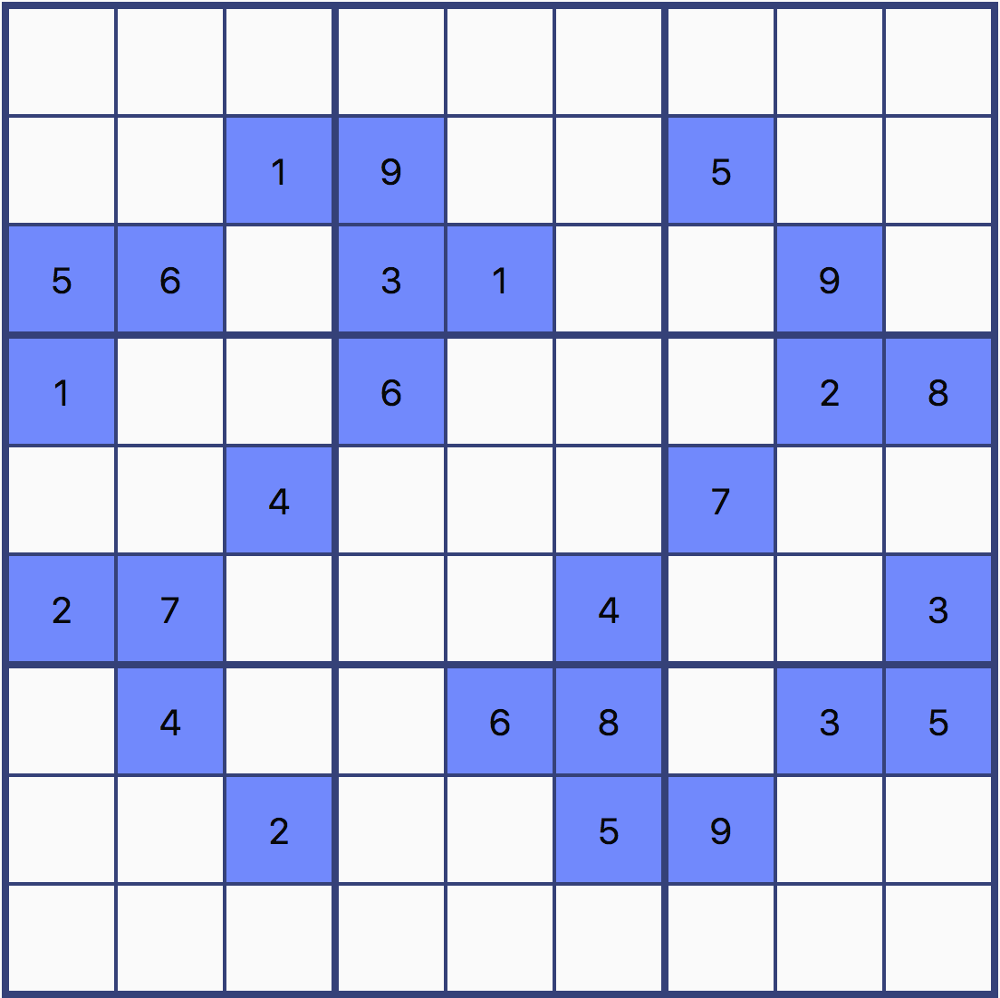
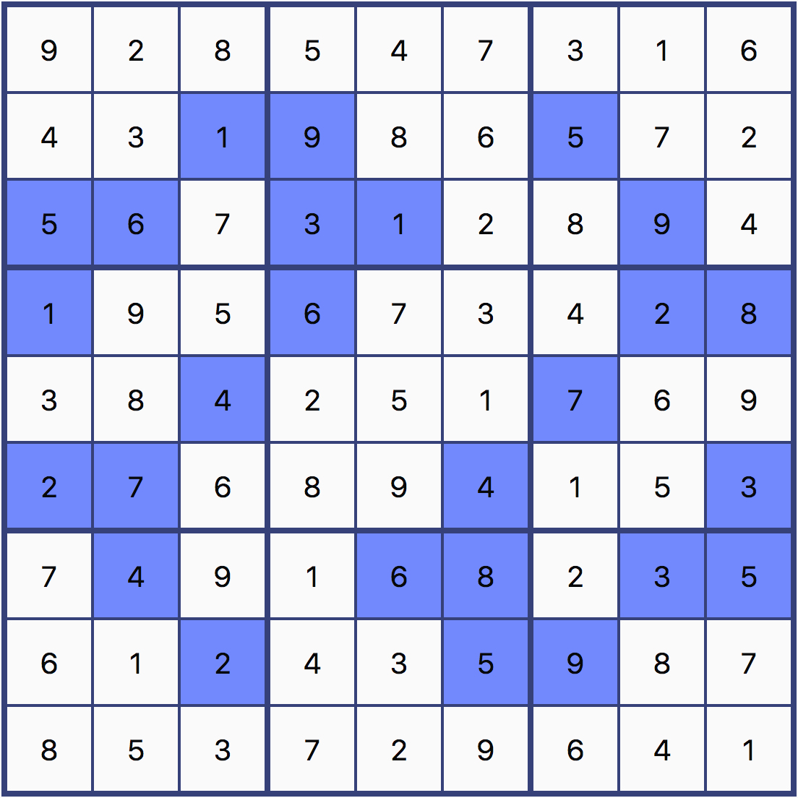

.. _tutorial:

********
Tutorial
********

The library can be imported with the ES6 import_ statement as follow::

    import {SudokuGrid, SudokuSolver} from "sudoku-javascript";

It can also be imported in a :term:`Node.JS` interactive shell, using the
require_ function::

    >>> const {SudokuGrid, SudokuSolver} = require("sudoku-javascript")

Let's consider the following example:

A :class:`~sudoku.grid.SudokuGrid` can be created with initial cell values::

    >>> const grid = new SudokuGrid({
    ...     c12: 1, c13: 9, c16: 5,
    ...     c20: 5, c21: 6, c23: 3, c24: 1, c27: 9,
    ...     c30: 1, c33: 6, c37: 2, c38: 8,
    ...     c42: 4, c46: 7,
    ...     c50: 2, c51: 7, c55: 4, c58: 3,
    ...     c61: 4, c64: 6, c65: 8, c67: 3, c68: 5,
    ...     c72: 2, c75: 5, c76: 9,
    ... })

The grid is composed of :class:`~sudoku.cell.SudokuCell` instances which
indicate the value and the candidates available::

    >>> const cell1 = grid.cell(0, 0)
    >>> cell1.isSolved()
    false

    >>> cell1.value
    0

    >>> cell1.candidates
    [1, 2, 3, 4, 5, 6, 7, 8, 9]

When the value of a cell is zero, it means that the cell is not solved yet. A
cell with a non-zero value is considered solved and does not have candidates::

    >>> const cell2 = grid.cell(1, 3)
    >>> cell1.isSolved()
    true

    >>> cell2.value
    9

    >>> cell2.candidates
    []

A :class:`~sudoku.solver.SudokuSolver` must then be created and used to resolve
the grid::

    >>> const solver = SudokuSolver()
    >>> solver.resolve(grid)
    true

If the process is successful, the grid is now solved::

    >>> grid.isSolved()
    true

The solver keep track of the strategies used to solve the grid::

    >>> solver.strategiesUsed
    [
        "Hidden Single Strategy",
        "Hidden Pair Strategy",
        "Hidden Triple Strategy",
    ]

The grid can then be returned as a mapping::

    >>> grid.toValueMapping()
    {
        c00: 9, c01: 2, c02: 8, c03: 5, c04: 4, c05: 7, c06: 3, c07: 1, c08: 6,
        c10: 4, c11: 3, c12: 1, c13: 9, c14: 8, c15: 6, c16: 5, c17: 7, c18: 2,
        c20: 5, c21: 6, c22: 7, c23: 3, c24: 1, c25: 2, c26: 8, c27: 9, c28: 4,
        c30: 1, c31: 9, c32: 5, c33: 6, c34: 7, c35: 3, c36: 4, c37: 2, c38: 8,
        c40: 3, c41: 8, c42: 4, c43: 2, c44: 5, c45: 1, c46: 7, c47: 6, c48: 9,
        c50: 2, c51: 7, c52: 6, c53: 8, c54: 9, c55: 4, c56: 1, c57: 5, c58: 3,
        c60: 7, c61: 4, c62: 9, c63: 1, c64: 6, c65: 8, c66: 2, c67: 3, c68: 5,
        c70: 6, c71: 1, c72: 2, c73: 4, c74: 3, c75: 5, c76: 9, c77: 8, c78: 7,
        c80: 8, c81: 5, c82: 3, c83: 7, c84: 2, c85: 9, c86: 6, c87: 4, c88: 1,
    }

Which once translated into a grid gives the following result:

.. _import: https://developer.mozilla.org/en-US/docs/Web/JavaScript/Reference/Statements/import
.. _require: https://nodejs.org/api/modules.html#modules_require
